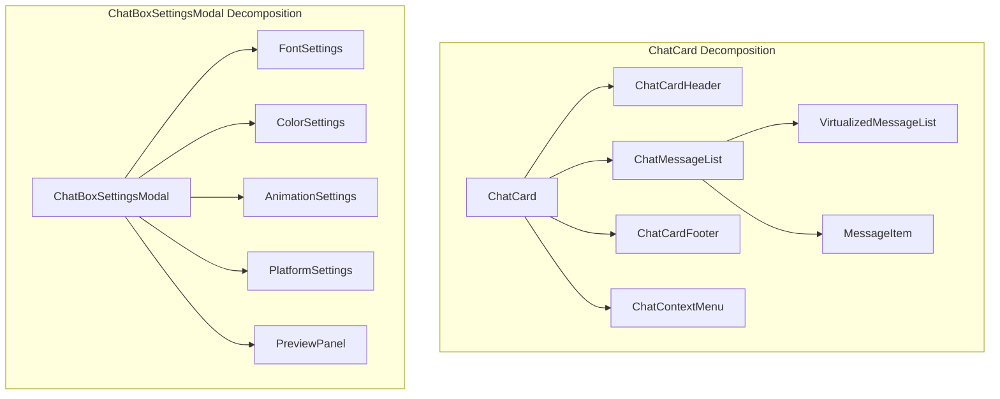

# Design Document: Frontend TypeScript & Linting

## Overview

Комплексный рефакторинг фронтенд-части для достижения строгой типизации, чистого кода и соответствия современным стандартам разработки. Проект использует React 19, TypeScript 5.9, Vite 7, React Query 5 и Radix UI.

### Текущее состояние
- ~50 TypeScript ошибок (отсутствующие типы, несовместимые типы)
- ~50 ESLint ошибок (unused vars, complexity, max-lines)
- Компоненты с высокой сложностью (ChatCard: 1340 строк, ChatBoxSettingsModal: 791 строка)
- Неполные типы для API ответов
- Отсутствие строгого режима TypeScript

### Целевое состояние
- 0 TypeScript ошибок с `strict: true`
- 0 ESLint ошибок
- Все компоненты < 150 строк, complexity < 15
- Полные типы для всех API endpoints
- Автоматическая проверка при коммите

## Architecture

### Структура типов

```
frontend/src/types/
├── api.d.ts          # Базовые API типы (ApiResponse, ApiError)
├── admin.d.ts        # Типы админ-панели
├── chat.d.ts         # Типы чата
├── commands.d.ts     # Типы команд
├── drops.d.ts        # Типы Drops системы
├── tts.d.ts          # Типы TTS
├── user.d.ts         # Типы пользователя
├── stream.d.ts       # Типы стрима
├── youtube.d.ts      # Типы YouTube
└── index.d.ts        # Реэкспорт всех типов
```

### Архитектура компонентов (после рефакторинга)



## Components and Interfaces

### Типы API ответов (расширенные)

```typescript
// frontend/src/types/api.d.ts

/**
 * Базовый тип для API ответа с generic data
 */
export interface ApiResponse<T = unknown> {
  success: boolean;
  data?: T;
  error?: string;
  message?: string;
}

/**
 * Типизированный ответ для админ API
 */
export interface AdminApiResponse<T> extends ApiResponse<T> {
  pagination?: PaginationInfo;
}

/**
 * Информация о пагинации
 */
export interface PaginationInfo {
  page: number;
  limit: number;
  total: number;
  pages: number;
}

/**
 * Типы для конкретных админ endpoints
 */
export interface BlockedChannelsResponse {
  blocked_channels: BlockedChannel[];
}

export interface BlockedChannel {
  id: number;
  channel_name: string;
  platform: 'twitch' | 'vk';
  reason?: string;
  blocked_at: string;
}

export interface BotStatusResponse {
  bots: BotInfo[];
  tts_service: TtsServiceStatus;
}

export interface BotInfo {
  platform: 'twitch' | 'vk';
  connected: boolean;
  channel_name?: string;
  uptime?: number;
}

export interface TtsServiceStatus {
  available: boolean;
  version?: string;
  voices_count?: number;
}
```

### Интерфейсы компонентов

```typescript
// frontend/src/components/chat/types.ts

export interface ChatCardProps {
  className?: string;
  initialPlatforms?: Platform[];
}

export interface ChatMessageListProps {
  messages: ChatMessage[];
  onContextMenu: (action: string, message: ChatMessage) => void;
  isLoading?: boolean;
}

export interface MessageItemProps {
  message: ChatMessage;
  onContextMenu: (action: string) => void;
  showPlatformIcon?: boolean;
  showBadges?: boolean;
}

// Унифицированный тип сообщения
export interface Message {
  id: string;
  author: string;
  content: string;
  timestamp: string;
  platform: Platform;
  badges?: string[];
  color?: string;
}

export type Platform = 'twitch' | 'vk' | 'youtube';
```

## Data Models

### Схема типов для Drops

```typescript
// frontend/src/types/drops.d.ts (расширенный)

export interface DropsConfig {
  channel_name: string;
  platform?: Platform;
  // Streak settings
  streak_enabled_twitch: boolean;
  streak_enabled_vk: boolean;
  streak_days_common: number;
  streak_days_rare: number;
  streak_days_epic: number;
  streak_days_legendary: number;
  streak_messages_required: number;
  streak_reset_on_skip: boolean;
  // Donation settings
  donation_enabled: boolean;
  donation_amount_common: number;
  donation_amount_rare: number;
  donation_amount_epic: number;
  donation_amount_legendary: number;
  // Mythical settings
  mythical_enabled: boolean;
  mythical_min_interval_hours: number;
  mythical_max_interval_hours: number;
  mythical_window_duration_minutes: number;
  mythical_donation_amount: number;
  // Widget settings
  widget_spinning_duration_ms: number;
  widget_opening_duration_ms: number;
  widget_result_duration_ms: number;
}

// Форма данных с index signature для совместимости
export interface DonationSettingsFormData extends DonationGridFormData {
  donation_enabled: boolean;
  mythical_enabled: boolean;
  mythical_min_interval_hours: number;
  mythical_max_interval_hours: number;
  mythical_window_duration_minutes: number;
  mythical_donation_amount: number;
}

export interface DonationGridFormData {
  donation_amount_common: number;
  donation_amount_rare: number;
  donation_amount_epic: number;
  donation_amount_legendary: number;
  [key: string]: number;
}
```

### Схема типов для Admin

```typescript
// frontend/src/types/admin.d.ts (расширенный)

export interface AdminLog {
  id: number;
  level: 'info' | 'warning' | 'error' | 'debug';
  message: string;
  timestamp: string;
  source?: string;
  details?: Record<string, unknown>;
}

export interface LogStats {
  total: number;
  by_level: Record<string, number>;
  by_source: Record<string, number>;
}

export interface LogsResponse {
  logs: AdminLog[];
  stats: LogStats;
  sources: string[];
}

export interface SupportTicket {
  id: number;
  user_id: number;
  username: string;
  subject: string;
  message: string;
  status: 'open' | 'in_progress' | 'resolved' | 'closed';
  priority: 'low' | 'medium' | 'high';
  created_at: string;
  updated_at?: string;
  is_archived: boolean;
}

export interface TicketsResponse {
  tickets: SupportTicket[];
  pagination: PaginationInfo;
}
```

## Correctness Properties

*A property is a characteristic or behavior that should hold true across all valid executions of a system—essentially, a formal statement about what the system should do. Properties serve as the bridge between human-readable specifications and machine-verifiable correctness guarantees.*

### Property 1: Zero Compilation Errors

*For any* source file in the frontend codebase, running the TypeScript compiler with strict mode enabled SHALL produce zero type errors.

**Validates: Requirements 1.1, 2.1, 5.2**

### Property 2: Type Coverage Completeness

*For any* API endpoint used in the frontend, there SHALL exist a corresponding TypeScript type definition that accurately describes the request and response shapes.

**Validates: Requirements 1.3, 4.1, 4.2, 5.1**

### Property 3: Component Size Compliance

*For any* React component file, the function body SHALL not exceed 150 lines of code (excluding imports, comments, and type definitions).

**Validates: Requirements 2.3, 3.1**

### Property 4: Cyclomatic Complexity Compliance

*For any* function in the frontend codebase, the cyclomatic complexity SHALL not exceed 15.

**Validates: Requirements 2.4, 3.2**

### Property 5: No Unused Code

*For any* variable, import, or function defined in the codebase, it SHALL be used at least once, or prefixed with underscore to indicate intentional non-use.

**Validates: Requirements 2.2, 6.3**

### Property 6: API Error Type Consistency

*For any* API error caught in the frontend, it SHALL be typed as ApiError and contain error_code and message fields.

**Validates: Requirements 7.1, 7.2**

## Error Handling

### Стратегия обработки ошибок

```typescript
// frontend/src/utils/errorUtils.ts

import { ApiError, ApiErrorCode } from '@/types/api';

/**
 * Type guard для проверки ApiError
 */
export function isApiError(error: unknown): error is ApiError {
  return (
    typeof error === 'object' &&
    error !== null &&
    'error_code' in error &&
    'message' in error
  );
}

/**
 * Безопасное извлечение сообщения ошибки
 */
export function getErrorMessage(error: unknown): string {
  if (isApiError(error)) {
    return error.message;
  }
  if (error instanceof Error) {
    return error.message;
  }
  return 'Произошла неизвестная ошибка';
}

/**
 * Обработка ошибок в Error Boundary
 */
export function handleBoundaryError(
  error: Error,
  errorInfo: React.ErrorInfo
): void {
  // Log to Sentry or other monitoring
  console.error('Error Boundary caught:', error, errorInfo);
}
```

### Типизация Error Boundaries

```typescript
// frontend/src/components/ErrorBoundary/types.ts

export interface ErrorBoundaryProps {
  children: React.ReactNode;
  fallback?: React.ReactNode;
  onError?: (error: Error, errorInfo: React.ErrorInfo) => void;
}

export interface ErrorBoundaryState {
  hasError: boolean;
  error: Error | null;
}
```

## Testing Strategy

### Dual Testing Approach

Проект использует комбинацию unit-тестов и property-based тестов для комплексного покрытия.

#### Unit Tests (Vitest)
- Тестирование конкретных примеров и edge cases
- Тестирование интеграции компонентов
- Snapshot тесты для UI компонентов

#### Property-Based Tests (fast-check)
- Проверка универсальных свойств на множестве входных данных
- Минимум 100 итераций на каждый property test
- Аннотация тестов ссылками на требования

### Конфигурация тестов

```typescript
// vitest.config.ts
import { defineConfig } from 'vitest/config';

export default defineConfig({
  test: {
    globals: true,
    environment: 'jsdom',
    setupFiles: ['./src/tests/setup.ts'],
    include: ['src/**/*.{test,spec}.{ts,tsx}'],
    coverage: {
      provider: 'v8',
      reporter: ['text', 'json', 'html'],
      exclude: ['node_modules/', 'src/tests/'],
    },
  },
});
```

### Примеры тестов

```typescript
// frontend/src/types/__tests__/api.test.ts
import { describe, it, expect } from 'vitest';
import fc from 'fast-check';
import { isApiError, getErrorMessage } from '@/utils/errorUtils';

describe('API Error Handling', () => {
  // Unit test - specific example
  it('should identify valid ApiError objects', () => {
    const validError = { error_code: 'NOT_FOUND', message: 'Resource not found' };
    expect(isApiError(validError)).toBe(true);
  });

  // Property test - universal property
  // Feature: frontend-typescript-linting, Property 6: API Error Type Consistency
  it('should always extract message from ApiError', () => {
    fc.assert(
      fc.property(
        fc.record({
          error_code: fc.string(),
          message: fc.string(),
        }),
        (error) => {
          const message = getErrorMessage(error);
          return message === error.message;
        }
      ),
      { numRuns: 100 }
    );
  });
});
```

### ESLint Configuration (обновлённая)

```javascript
// eslint.config.js
import js from '@eslint/js';
import globals from 'globals';
import reactHooks from 'eslint-plugin-react-hooks';
import reactRefresh from 'eslint-plugin-react-refresh';
import tseslint from 'typescript-eslint';
import importPlugin from 'eslint-plugin-import';

export default [
  {
    ignores: ['dist', 'node_modules', 'build', '*.config.js'],
  },
  js.configs.recommended,
  ...tseslint.configs.strictTypeChecked,
  {
    files: ['**/*.{ts,tsx}'],
    languageOptions: {
      parser: tseslint.parser,
      parserOptions: {
        project: './tsconfig.json',
      },
      globals: globals.browser,
    },
    plugins: {
      'react-hooks': reactHooks,
      'react-refresh': reactRefresh,
      'import': importPlugin,
    },
    rules: {
      // TypeScript strict rules
      '@typescript-eslint/no-unused-vars': ['error', { 
        argsIgnorePattern: '^_',
        varsIgnorePattern: '^_',
      }],
      '@typescript-eslint/no-explicit-any': 'error',
      '@typescript-eslint/strict-boolean-expressions': 'warn',
      
      // React rules
      'react-hooks/rules-of-hooks': 'error',
      'react-hooks/exhaustive-deps': 'warn',
      
      // Complexity rules
      'max-lines-per-function': ['error', { max: 150, skipBlankLines: true, skipComments: true }],
      'complexity': ['error', 15],
      'max-depth': ['error', 4],
      
      // Import rules
      'no-duplicate-imports': 'error',
      'import/no-cycle': 'error',
      'import/order': ['warn', {
        groups: ['builtin', 'external', 'internal', 'parent', 'sibling', 'index', 'type'],
        'newlines-between': 'always',
      }],
    },
  },
];
```

### TypeScript Configuration (strict)

```json
// tsconfig.json
{
  "compilerOptions": {
    "target": "ES2020",
    "lib": ["ES2020", "DOM", "DOM.Iterable"],
    "module": "ESNext",
    "moduleResolution": "bundler",
    "jsx": "react-jsx",
    
    // Strict mode - all enabled
    "strict": true,
    "noImplicitAny": true,
    "strictNullChecks": true,
    "strictFunctionTypes": true,
    "strictBindCallApply": true,
    "strictPropertyInitialization": true,
    "noImplicitThis": true,
    "alwaysStrict": true,
    
    // Additional checks
    "noUnusedLocals": true,
    "noUnusedParameters": true,
    "noImplicitReturns": true,
    "noFallthroughCasesInSwitch": true,
    "noUncheckedIndexedAccess": true,
    
    // Paths
    "baseUrl": ".",
    "paths": {
      "@/*": ["./src/*"]
    },
    
    // Other
    "resolveJsonModule": true,
    "isolatedModules": true,
    "skipLibCheck": true,
    "esModuleInterop": true,
    "allowSyntheticDefaultImports": true,
    "forceConsistentCasingInFileNames": true,
    "noEmit": true
  },
  "include": ["src/**/*"],
  "exclude": ["node_modules", "dist"]
}
```
