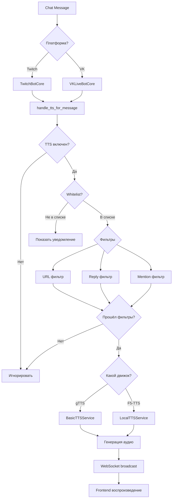

# 🎙️ TTS Architecture - Полная документация системы озвучки

**Последнее обновление:** 27 октября 2025

---

## 📋 Обзор

Система TTS (Text-to-Speech) поддерживает два режима работы:
1. **☁️ Cloud TTS** (gTTS) - облачный, бесплатный, без установки
2. **💻 Local TTS** (F5-TTS) - локальный, требует GPU/CPU, кастомные голоса

---

## 🏗️ Архитектура

### Cloud TTS (gTTS)

```
Twitch/VK Chat → bot_service → TTS Queue → gTTS API → Audio → WebSocket → Frontend
```

**Компоненты:**
- `bot_service/services/basic_tts.py` - основная логика
- `bot_service/services/tts_queue_service.py` - очередь сообщений
- `bot_service/utils/websocket_helper.py` - трансляция в frontend

**Преимущества:**
- ✅ Бесплатный
- ✅ Не требует настройки
- ✅ Работает на любом железе
- ✅ Быстрый (1-2 сек на сообщение)

**Недостатки:**
- ❌ Только 1 голос (женский, RU)
- ❌ Требует интернет
- ❌ Ограничения Google API

---

### Local TTS (F5-TTS)

```
User PC → tts_service_simple (FastAPI) → F5-TTS (GPU/CPU) → Audio → bot_service → Frontend
```

**Компоненты:**
- `tts_service_simple/main.py` - FastAPI сервер
- `tts_service_simple/TTS_rus_engine/` - F5-TTS движок
- `bot_service/api/tts_api.py` - интеграция с основным сервисом

**Преимущества:**
- ✅ Кастомные голоса (без ограничений количества)
- ✅ Работает offline
- ✅ Высокое качество голоса
- ✅ Тонкая настройка (speed, pitch, etc.)

**Недостатки:**
- ❌ Требует GPU (NVIDIA) для нормальной скорости
- ❌ На CPU ~30 сек на сообщение
- ❌ Требует 4GB+ VRAM
- ❌ Сложная установка (PyTorch + CUDA)

---

## 🔄 Control Flow

### 1. Новое сообщение в чате



### 2. Включение/выключение TTS

```javascript
// frontend/src/context/TtsContext.jsx
const toggleTts = async (enable) => {
  // 1. Обновляем UI (optimistic update)
  setTtsEnabled(enable);
  
  // 2. Отправляем на backend
  await api.post('/api/tts/toggle', { enabled: enable });
  
  // 3. Backend сохраняет в БД
  // 4. WebSocket broadcast всем клиентам
  // 5. Синхронизация состояния
};
```

### 3. Смена голоса (Local TTS)

```python
# bot_service/api/tts_api.py
@router.post("/api/local-tts/voices/{voice_id}/samples")
async def upload_voice_sample(
    voice_id: str,
    file: UploadFile,
    user: User = Depends(get_current_user)
):
    # 1. Валидация формата (WAV, MP3, etc.)
    # 2. Сохранение в user_configs/{user_id}/voices/{voice_id}/
    # 3. Обновление метаданных в voices.json
    # 4. Возврат списка сэмплов
```

---

## 📊 Database Schema

### TTSUserSettings

```sql
CREATE TABLE tts_user_settings (
    id INTEGER PRIMARY KEY,
    user_id INTEGER NOT NULL,
    enabled BOOLEAN DEFAULT 0,
    engine TEXT DEFAULT 'gtts', -- 'gtts' | 'f5tts'
    voice TEXT DEFAULT 'ru',
    volume INTEGER DEFAULT 100,
    speed REAL DEFAULT 1.0,
    pitch REAL DEFAULT 1.0,
    max_message_length INTEGER DEFAULT 500,
    skip_commands BOOLEAN DEFAULT 1,
    enable_7tv BOOLEAN DEFAULT 0,
    enable_twitch BOOLEAN DEFAULT 0,
    filter_replies BOOLEAN DEFAULT 0,
    filter_mentions BOOLEAN DEFAULT 0,
    FOREIGN KEY (user_id) REFERENCES users(id)
);
```

### LocalTTSEndpoint

```sql
CREATE TABLE local_tts_endpoints (
    id INTEGER PRIMARY KEY,
    user_id INTEGER,
    session_id TEXT,
    endpoint_url TEXT NOT NULL,
    is_active BOOLEAN DEFAULT 1,
    created_at TIMESTAMP DEFAULT CURRENT_TIMESTAMP,
    CHECK ((user_id IS NOT NULL AND session_id IS NULL) OR 
           (user_id IS NULL AND session_id IS NOT NULL))
);
```

---

## 🔌 API Endpoints

### Cloud TTS (gTTS)

```http
POST /api/tts/toggle
Body: { "enabled": true }
Response: { "success": true, "enabled": true }

GET /api/tts/settings
Response: {
  "enabled": true,
  "engine": "gtts",
  "voice": "ru",
  "volume": 100,
  ...
}

POST /api/tts/settings
Body: { "volume": 80, "speed": 1.2 }
Response: { "success": true }

POST /api/tts/block
Body: { "username": "spammer123", "platform": "twitch" }
Response: { "success": true }
```

### Local TTS (F5-TTS)

```http
GET /api/local-tts/config
Response: {
  "configured": true,
  "healthy": true,
  "whitelisted": true,
  "endpoint_url": "http://localhost:8001",
  "gpu_info": { ... }
}

POST /api/local-tts/save-config
Body: { "endpoint_url": "http://localhost:8001" }
Response: { "success": true }

POST /api/local-tts/test-connection
Body: { "url": "http://localhost:8001" }
Response: { "success": true, "healthy": true }

GET /api/local-tts/voices
Response: {
  "voices": [
    { "id": "voice1", "name": "Женский голос", "samples": 5 }
  ]
}

POST /api/local-tts/voices
Body: { "name": "Мужской голос" }
Response: { "voice_id": "voice2" }

POST /api/local-tts/voices/{voice_id}/samples
Body: FormData (audio file)
Response: { "sample_id": "sample1" }

DELETE /api/local-tts/voices/{voice_id}
Response: { "success": true }
```

---

## 🎛️ Frontend Components

### TtsMainPage

```jsx
// frontend/src/pages/tts/TtsMainPage.jsx
<TtsMainPage>
  <TtsControlPanel /> {/* ON/OFF toggle */}
  <AudioSettings /> {/* Volume, Speed, Pitch */}
  <TtsSettings /> {/* 7TV, Twitch emojis */}
  <TtsFilterManager /> {/* Blacklist, Word filter */}
  <HealthStatus /> {/* Server health check */}
</TtsMainPage>
```

### LocalTTSSettingsPage

```jsx
// frontend/src/pages/tts/LocalTTSSettingsPage.jsx
<LocalTTSSettingsPage>
  <Tabs>
    <Tab value="connection">
      <ConnectionWizard /> {/* URL, Test, Save */}
    </Tab>
    <Tab value="voices">
      <VoiceManager /> {/* Upload samples, Create voices */}
    </Tab>
    <Tab value="monitoring">
      <HealthMonitor /> {/* GPU, Uptime, Status */}
    </Tab>
  </Tabs>
</LocalTTSSettingsPage>
```

---

## 🔧 Configuration

### Backend (.env)

```bash
# TTS Service URL (optional, для Local TTS)
TTS_SERVICE_URL=http://localhost:8001

# TTS Whitelist (обязательно для production)
TTS_WHITELIST_ENABLED=true
```

### Local TTS Service (.env)

```bash
# FastAPI port
PORT=8001

# Model settings
MODEL_NAME=F5-TTS
DEVICE=cuda  # or 'cpu'

# Audio settings
SAMPLE_RATE=24000
AUDIO_FORMAT=wav
```

---

## 🚀 Quick Start

### Cloud TTS (gTTS)

1. Открыть `/dashboard/tts`
2. Нажать "Включить TTS"
3. Написать сообщение в чат
4. Готово! 🎉

### Local TTS (F5-TTS)

1. Установить `tts_service_simple`:
   ```bash
   cd tts_service_simple
   python install.py  # Установит PyTorch + F5-TTS
   ```

2. Запустить сервис:
   ```bash
   python main.py  # Или start.bat на Windows
   ```

3. Подключить в UI:
   - Открыть `/dashboard/tts/local`
   - Ввести URL: `http://localhost:8001`
   - Нажать "Проверить подключение"
   - Нажать "Сохранить"

4. Добавить голоса:
   - Перейти на вкладку "Управление голосами"
   - Создать новый голос
   - Загрузить 3-5 сэмплов (WAV, 10-30 сек)
   - Сохранить

5. Готово! 🎉

---

## ❓ FAQ

### Q: Почему TTS не озвучивает сообщения?

**A:** Проверь:
1. TTS включен? (`/dashboard/tts` → Toggle должен быть ON)
2. Канал в whitelist? (Для production обязательно!)
3. Фильтры не блокируют? (URL, replies, mentions)
4. Backend запущен? (Проверь логи `bot_service/bot_service.log`)

### Q: Local TTS очень медленный (30+ сек)

**A:** Это нормально для CPU. F5-TTS требует GPU (NVIDIA) для нормальной скорости (~3-5 сек). На CPU можно использовать gTTS вместо F5-TTS.

### Q: Сколько голосов можно создать в Local TTS?

**A:** **Без ограничений!** Файлы хранятся локально на вашем ПК. Для cloud TTS (gTTS) - только 1 голос (женский RU).

### Q: Как работают фильтры?

**A:**
- **URL Filter**: Автоматически блокирует сообщения с http://, https://, www.
- **Reply Filter**: Игнорирует ответы на другие сообщения (если включено)
- **Mention Filter**: Игнорирует сообщения с @упоминаниями (если включено)

### Q: Можно ли использовать оба движка одновременно?

**A:** Нет. Выбор движка глобальный: либо gTTS (cloud), либо F5-TTS (local). Но можно переключаться в любой момент в `/dashboard/tts`.

---

**Версия:** 2.0  
**Статус:** ✅ Production Ready  
**Последнее обновление:** 27 октября 2025

